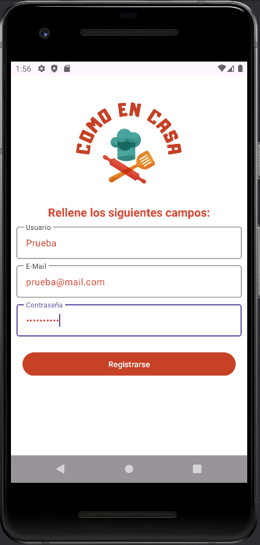

# Como En Casa

## **Índice de contenido**
  - [**Índice de contenido**](#índice-de-contenido)
  - [**Introducción**](#introducción)
  - [**Aplicación móvil**](#aplicación-móvil)
    - [*Descripción*](#descripción)
    - [*Funcionalidades*](#funcionalidades)
      - [Login del usuario](#login-del-usuario)
      - [Registro del usuario](#registro-del-usuario)
      - [Pantalla de inicio](#pantalla-de-inicio)
      - [Ver receta recomendada](#ver-receta-recomendada)
      - [Buscar receta](#buscar-receta)
      - [Ver lista de favoritos](#ver-lista-de-favoritos)
      - [Ver menú semanal](#ver-menu-semanal)
      - [Ver nevera](#ver-nevera)
      - [Ver perfil](#ver-perfil)
  - [**Aplicación de escritorio**](#aplicación-de-escritorio)
    - [*Descripción*](#descripcicón-1)
    - [*Funcionalidades*](#funcionalidades-1)
      - [Login del administrador](#login-del-administrador)
      - [Pantalla de inicio](#pantalla-de-inicio-1)
      - [Ver usuarios](#ver-usuarios)
      - [Añadir receta](#añadir-receta)
      - [Modificar receta](#modificar-receta)
      - [Eliminar receta](#Eliminar-receta)
      - [Añadir ingrediente](#añadir-ingrediente)
      - [Modificar ingrediente](#modificar-ingrediente)
      - [Eliminar ingrediente](#Eliminar-ingrediente)
  - [**API**](#api)
    - [*Descripción*](#descripcicón-1)
      - [Model](#model)
      - [DTO](#dto)
      - [Repository](#repository)
      - [Service](#service)
      - [Controller](#controller)
  - [**Autores del proyecto**](#autores-del-proyecto)

## **Introducción**
*Como en casa* es un proyecto que busca acercar a la gente a la cocina casera a través de recetas sencillas, para que, de esta forma, aprendan a comer sano, rico y además a evitar el desperdicio de alimentos.

El resultado de este proyecto son dos aplicaciónes: una aplicación móvil donde un usuario podrá gestionar las recetas en su lista de favoritos, y una aplicación móvil donde los administradores podrán crear y modificar ingredientes y recetas. Todas estas gestiones se realizarán mediante una API que realizará la conexión a la base de datos.

## **Aplicación móvil**
### *Descripción*
La aplicación móvil está diseñada para Android (11 o superior), y está programada en Kotlin con Android Studio Hedgehog 2023.1.1.

### *Funcionalidades*
#### Login del usuario

El login será la primera pantalla que verá el usuario al acceder a la aplicación. El logo de Como en Casa va a encabezar esta pantalla y el usuario tendrá que indicar su correo electrónico y contraseña, y clickar en el botón *`Acceder`* para poder acceder a la [pantalla de inicio](#pantalla-de-inicio) de la aplicación.

En caso de que no esté registrado, tendrá que registrarse clickando en el botón *`Registrarse`* que le llevará a la pantalla de [registro del usuario](#registro-del-usuario).

#### Registro del usuario

Si el usuario no está registrado, deberá clickar en el botón *`Registrarse`* de la pantalla de [login del usuario](#login-del-usuario). En la pantalla de registro deberá indicar un nombre de usuario, un correo electrónico y una contraseña y, al clickar en el botón *`Registrarse`* accederá a la [pantalla de inicio](#pantalla-de-inicio) de la aplicación.

#### Pantalla de inicio

En la pantalla de inicio el usuario podrá ver en la parte superior de la pantalla un menú mediante el cual navegar entre las distintas pantallas: [lista de favoritos](#ver-lista-de-favoritos), [menú semanal](#ver-menú-semanal), [ver nevera](#ver-nevera) y [ver perfil](#ver-perfil).

Debajo de este menú se encuentra la [receta recomendada](#ver-receta-recomendada). Para acceder a ella deberá clickar en la imagen.

Por último, debajo de la [receta recomendada](#ver-receta-recomendada), el usuario tendrá la opción de [buscar receta](#buscar-receta).

A continuación se explicarán todas las pantallas antes mencionadas.

#### Ver receta recomendada
Para acceder a la receta recomendada, el usuario deberá clickar en la imagen que se encuentra en la [pantalla de inicio](#pantalla-de-inicio). En la nueva pantalla que se abre el usuario verá el nombre de la receta, la imagen de la misma, los ingredientes así como cantidades de los mismos necesarios para la receta, y una descripción de los pasos a seguir para realizarla.

Por último, el usuario tendrá un botón *`Guardar receta`* que le permitirá guardar la receta en favoritos o, *`Quitar receta`* en caso de que ya esté, eliminarla de favoritos si no desea seguir teniendo esta receta guardada.

#### Buscar receta
*Actualmente no implementado*
Para buscar una receta en la base de datos el usuario deberá, en la [pantalla de inicio](#pantalla-de-inicio), indicar entre uno y tres ingredientes y clickar sobre el botón *`Buscar receta`*.

En la nueva pantalla que se abre se le mostrará al usuario una lista con todas las recetas que hay almacenadas en la base de datos que contengan al menos uno de los ingredientes especificados en la [pantalla de inicio](#pantalla-de-inicio).

#### Ver lista de favoritos

Para acceder a la lista de favoritos el usuario deberá clickar en el menú superior en el segundo botón llamado *`Favoritos`*. De esta manera se abrirá una pantalla con todas las recetas que el usuario tenga guardadas en su lista de favoritos.

El usuario podrá filtrar en la lista de favoritos escribiendo en el SearchBox situado en la parte superior de la pantalla, en caso de que busque una receta en concreto en su lista de favoritos.

Clickando en cualquiera de las recetas se abrirá una pantalla con el nombre de la receta, la imagen de la misma, los ingredientes así como cantidades de los mismos necesarios para la receta, y una descripción de los pasos a seguir para realizarla.

En la parte inferior se encontrará un botón, *`Quitar receta`* en caso de que el usuario quiera eliminar dicha receta de su lista de favoritos.

#### Ver menú semanal
*Actualmente no implementado*
Para acceder al menú semanal el usuario deberá clickar en el menú superior en el botón central llamado *`Menú semanal`*.

Al hacerlo se abrirá una nueva pantalla donde el usuario podrá gestionar las recetas para configurarse su propio menú semanal.

#### Ver nevera
*Actualmente no implementado*
Para acceder a la nevera el usuario deberá clickar en el menú super en el penúltimo botón llamado *`Nevera`*.

En esta pantalla el usuario podrá agregar ingredientes a su nevera o eliminarlos, en caso de que ya no disponga de ellos.

#### Ver perfil

Para acceder a su perfil el usuario deberá clickar en el menú superior en el último botón llamado *`Perfil`*.

En la nueva pantalla que se abra el usuario podrá modificar sus datos de acceso. En caso de hacerlo, para guardar estos datos deberá pulsar en el botón *`Aceptar`*. También puede descartar dichos cambios pulsando en el botón *`Cancelar`*.

---

## **Aplicación de escritorio**
### *Descripción*
La aplicación de escritorio está programada en C# con Visual Studio 2022.

### *Funcionalidades*
#### Login del administrador

Al iniciar la aplicación, el administrador deberá indicar sus credenciales, es decir, el correo electrónico y la contraseña del administrador. En caso de que las credenciales sean correctas, se abrirá un MessageBox con el mensaje 'Acceso autorizado' y, al clickar en el botón *`Aceptar`* se le abrirá la pantalla de inicio de la aplicación de escritorio.

En caso de que las credenciales sean incorrectas, se abrirá un MessageBox con el mensaje 'Usuario o contraseña incorrectos' y no se podrá acceder a la siguiente pantalla.

#### Pantalla de inicio

En la pantalla de inicio, encabezando la ventana, estará un saludo donde se muestra el nombre del administrador que está ejecutando la aplicación y, justamente debajo, se encontrará el logo de la aplicación. Inmediatamente debajo del logo se encuentra el botón [*`ver usuarios`*](#ver-usuarios) y, a ambos lados de este botón habrá una división donde se va a ubicar a la izquierda toda la información y gestión de las recetas, mientras que a la derecha se va a encontrar lo mismo, acerca de los ingredientes. Para saber en qué lado se encuentra cada cosa, hay un texto que así lo indica, por lo tanto nos vamos a encontrar con lo siguiente:

- En el lado izquierdo: recetas

Con un texto se indica que en esta parte de la ventana va a haber información acerca de las recetas.
Mediante tres botones, se puede realizar la gestión de dichas recetas que se traduce en: [*`añadir receta`*](#añadir-receta), [*`modificar receta`*](#modificar-receta) y [*`eliminar receta`*](#eliminar-receta).

Debajo de estos tres botones se encuentra un DataGridView con la información de todas las recetas que hay actualmente en la base de datos y, para poder [*`modificar`*](#modificar-receta) o [*`eliminar`*](#eliminar-receta) una receta se deberá antes seleccionar una línea en el DataGridView.

- En el lado derecho: ingredientes

De manera similar a las recetas, lo primero que hay es un texto que indica que en la parte derecha de la ventana se va a trabajar con los ingredientes. También hay tres botones para poder gestionar los ingredientes, que son [*`añadir ingrediente`*](#añadir-ingrediente), [*`modificar ingrediente`*](#modificar-ingrediente) y [*`eliminar ingrediente`*](#eliminar-ingrediente).

Por último, hay un segundo DataGridView que muestra una lista con todos los ingredientes que hay en la base de datos y de la misma manera, para poder [*`modificar`*](#modificar-ingrediente) o [*`eliminar`*](#eliminar-ingrediente) un ingrediente primero se deberá seleccionar una línea del DataGridView.

#### Ver Usuarios

Al pulsar el botón *`ver usuarios`* en la [pantalla de inicio](#pantalla-de-inicio-1) se va abrir una nueva ventana donde se muestren todos los usuarios que hay registrados en la aplicación. En la parte superior de la tabla donde se muestra esta información se encuentran dos botones. En caso de que se quiera eliminar un usuario, en primer lugar se deberá seleccionar una línea en la tabla y a continuación pulsar el botón *`eliminar usuario`*. Esto abrirá un messageBox que pregunte si realmente se quiere realizar esta acción. Si se pulsa el botón *`Sí`*, el usuario será eliminado de la base de datos y se actualizará la tabla de usuarios sin este dato, mientras que si se pulsa el botón *`No`* se volverá a la ventana de Lista de usuarios sin alterar la tabla.

Por último, si no se quiere realizar ninguna acción, el usuario deberá pulsar el botón *`Salir`* para volver a la [pantalla de inicio](#pantalla-de-inicio-1).

#### Añadir receta

Al clickar en el botón *`añadir receta`* se abrirá una ventana donde el administrador tendrá que indicar los datos de la receta:

En primer lugar deberá introducir el nombre del ingrediente, después la URL de la imagen, la descripción con los pasos a seguir y un DataGridView que primeramente se mostrará vacío.

Debajo de la caja que permite introducir la URL de la imagen hay un botón *`Ver imagen`* que, al pulsarlo, abrirá una nueva ventana donde se va a mostrar la imagen de la URL introducida en la ventana anterior. El usuario podrá acceder a la URL de esta imagen si pulsa en el nombre de la misma ya que se trata de un hipervínculo. En caso de querer volver a la ventana anterior, deberá pulsar el botón *`salir`*.

El siguiente paso, para añadir ingredientes a la receta, será clickar en el botón *`añadir ingredientes`* que abrirá una nueva ventana con un DataGridView con la lista de todos los ingredientes. Una vez seleccionados los ingredientes que se quieran se deberá clickar en el botón *`añadir`*, por el contrario si se quiere volver a la ventana anterior sin guardar ingredientes, se deberá clickar el botón *`cancelar`*.

Si se seleccionaron varios ingredientes de la lista y se pulsó el botón *`añadir`*, estos ingredientes se mostrarán en el DGV que tendrá el nombre de ingrediente y una columna donde se deberá introducir la cantidad de los mismos.

Por último, pulsando el botón *`guardar`*, esta receta se guardará en la base de datos, se cerrará la ventana de la receta y se actualizará el DataGridView de recetas de la [pantalla de inicio](#pantalla-de-inicio-1).

#### Modificar receta

Para modificar receta primero se deberá seleccionar una receta en el DataGridView de recetas de la [pantalla de inicio](#pantalla-de-inicio-1) y a continuación pulsar el botón *`modificar receta`*.

Al hacerlo, se abrirá una ventana parecida a la de [añadir receta](#añadir-receta) y se podrán modificar los datos de la misma: cambiar nombre, añadir o modificar la imagen, modificar la descripción o modificar las cantidades de los ingredientes.

En caso de que se quieran añadir o eliminar ingredientes a la receta, se deberá una vez más pulsar sobre el botón *`añadir ingredientes`* y seleccionar los que se quieran en el DataGridView que se abra, igual que se hizo en el paso anterior.

Finalmente, pulsando el botón *`guardar`*, los cambios de la receta se guardarán en la base de datos, se cerrará la ventana de la receta y se actualizará el DataGridView de recetas de la [pantalla de inicio](#pantalla-de-inicio-1).

#### Eliminar receta

Para eliminar una receta se deberá en primer lugar seleccionar una receta en el DataGridView de recetas de la [pantalla de inicio](#pantalla-de-inicio-1) y a continuación pulsar el botón *`eliminar receta`*. Al hacerlo, la receta se eliminará directamente de la base de datos y del DataGridView de recetas.

#### Añadir ingrediente

Para crear un nuevo ingrediente se deberá pulsar sobre el botón *`añadir ingrediente`* de la [pantalla de inicio](#pantalla-de-inicio-1). Al hacerlo, se abrirá una ventana donde el administrador deberá rellenar los datos que se indiquen: el nombre del ingrediente, los meses desde cuando empieza a ser temporada y hasta que termina la temporada (en caso de que el ingrediente no tenga una temporalidad, no se tendrá que elegir ningún mes), y el tipo de alimento.

Al pulsar el botón *`guardar`* el ingrediente se guardará en la base de datos y se actualizará el GridView de ingredientes de la [pantalla de inicio](#pantalla-de-inicio-1). En caso de que no se quiera guardar el ingrediente, simplemente se deberá pulsar el botón *`cancelar`*.

#### Modificar ingrediente

Para poder modificar un ingrediente, lo primero que se deberá hacer es seleccionar un ingrediente en el DataGridView del lado de los ingredientes, en la [pantalla de inicio](#pantalla-de-inicio-1) y después pulsar el botón *`modificar ingrediente`*.

Al hacerlo se abrirá una nueva ventana, similar a la anterior de [añadir ingrediente](#añadir-ingrediente), pero en vez de tener los campos vacíos éstos estarán rellenados. Se deberá modificar el campo o los campos que se quieran y a continuación pulsar el botón *`guardar`*. Al hacerlo, los nuevos datos del ingrediente se habrán registrado en la base de datos, se cerrará la ventana y se mostrará la [pantalla de inicio](#pantalla-de-inicio-1) con el DataGridview con los datos actualizados del ingrediente. En caso de que no se quiera modificar ningún dato, se deberá pulsar el botón *`cancelar`* lo que hará que se cierre la ventana y se muestre la [pantalla de inicio](#pantalla-de-inicio-1) sin modificar el DataGridView de los ingredientes.

#### Eliminar ingrediente

Para eliminar un ingrediente se deberá en primer lugar seleccionar un ingrediente en el DataGridView de ingredientes de la [pantalla de inicio](#pantalla-de-inicio-1) y a continuación pulsar el botón *`eliminar ingrediente`*. Al hacerlo, el ingrediente se eliminará directamente de la base de datos y del DataGridView de ingredientes.

---

## **API**
### *Descripción*
La API está programada en lenguaje JAVA 17 con Visual Studio Code versión 1.92.1 (user setup) y se utiliza el framework SpringBoot versión 3.3.3. Se realiza la conexión con la base de datos mediante el gestor MySQL Workbecnh 8.0 CE.

#### Model

En Model se encuentran todas las clases que se van a corresponder con las entidades necesarias para crear la base de datos.

`User`:

`Recipe`:

`RecipeIngredient`:

`Ingredient`:

#### DTO

En DTO se encuentran todas las clases necesarias para transferir datos entre las capas de la aplicación, para no exponer directamente las entidades que se encuentran en Model, en las interfaces públicas.

`LoginDTO`:
Se necesita un LoginDTO porque a la hora de realizar el acceso a la aplicación, se recogerán los datos del usuario en un @Body, que contiene un DTO con únicamente los datos de acceso, lo que se traduce en el LoginDTO en la API.

`UserDTO`:

`RecipeDTO`:

`RecipeResponseDTO`:
En el caso de RecipeResponseDTO, esta clase se va a utilizar para devolver la lista de ingredientes de la receta de una forma más simplificada, en una lista de Strings.

`RecipeIngredientDTO`:

`IngredientDTO`:

#### Repository

En Repository se van a encontrar las interfaces que se encargan de la persistencia de datos.

`UserRepository`:

`RecipeRepository`:

`RecipeIngredientRepository`:

`IngredientRepository`:

#### Service

En Service se encuentran aquellas clases que contienen la lógica de negocio de la aplicación. Aquí, los servicios van a interactuar con los respositorios para realizar la persistencia de datos.

`UserService`:

`RecipeService`:

`ServiceService`:

#### Controller

El Controller va a albergar las clases que manejan las peticiones HTTP entrantes. Cada controller se encargará de dirigir la petición a los servicios correspondientes.

`UserController`:

`RecipeController`:

`IngredientController`:

---

## **Autores del proyecto**
:llama: Oana Irina Cutitaru Ciobanu :llama:

:godmode: Jerónimo Ruiz Posadas :godmode:
